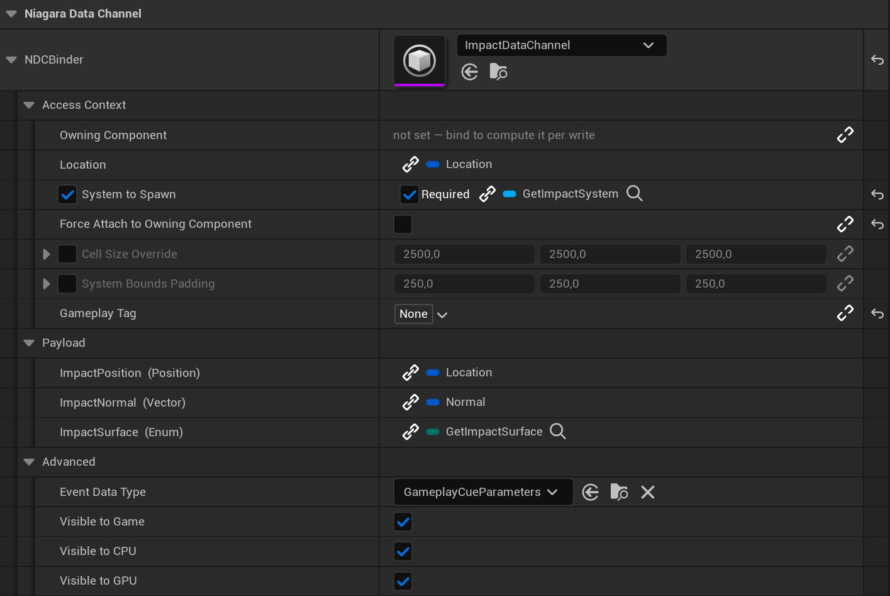
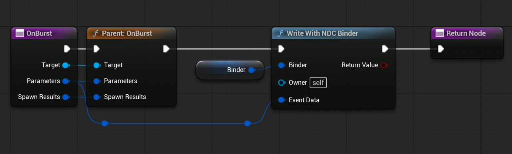

# NDC Binder

Binds a **Niagara Data Channel** write to data instead of a graph.

Embed one `FNDCBinder` in anything that pushes data to an NDC. The details panel reflects the
channel's own inputs into rows — its variables under *Payload*, its access context under *Access
Context* — and every row is either a constant you type in or a binding to a field of the event data
or a function on the owning class, through the same chain-icon binding widget UMG uses.

Both halves are bound the same way: where a write goes is authored exactly like what it carries.



Depends on Niagara and nothing else, and names no gameplay framework of its own, so the same binder
works from a GameplayCue, a Gameplay Ability, a component or a plain actor.

## Setting one up in Blueprint

No C++ required at any point.

**1. Add the binder.** Add a variable of type **NDC Binder**. Everything below is authored on it in
the details panel.

**2. Assign the Data Channel.** The picker is on the binder's header row. Rows appear the moment you
pick one — one per channel variable under *Payload*, one per access context input under *Access
Context*.

**3. Declare the event data type,** if your getters will take one. **Advanced → Event Data Type**,
set to the struct you pass to the write — `GameplayCueParameters` for a cue, your own struct
otherwise. Leave it unset and bound functions take no parameter.

**4. Fill the rows.** The chain icon opens the menu, which offers:

* **a constant** — typed into the row, nothing runs at write time;
* **a field of the event data** — at the top of the menu, nested members included. Prefer this:
  nothing is called, the member is simply read;
* **a function on this Blueprint** — below the fields. Only functions that fit the row are offered.

**Create Binding** in that menu writes a function with the right signature, binds the row to it, and
opens it for you to fill in.

**5. Place the write.** Call **Write With NDC Binder** where the effect should fire.



* `Binder` — your binder variable.
* `Owner` — defaults to Self. Bound functions are called on it.
* `Event Data` — connect your struct straight in; the pin is a wildcard and reads the graph's own
  struct where it sits, with no **Make Instanced Struct** in between. Leave it unconnected when no
  row needs event data.

For several elements at once — a shotgun's pellets, a chain of hits — use **Write Many With NDC
Binder**, whose `Event Data` is a wildcard array. One write of N is meaningfully cheaper than N
writes of one.

## From C++

Embedding and calling is all there is to it; rows are still authored in the panel.

```cpp
UPROPERTY(EditDefaultsOnly, Category = "Niagara Data Channel")
FNDCBinder NDCBinder;

AMyEffectActor::AMyEffectActor()
{
    // Optional: the struct bound functions take. Leave it unset and they take none.
    NDCBinder.InitEventDataType(FMyEventData::StaticStruct());
}

void AMyEffectActor::Fire(const FMyEventData& EventData)
{
    NDCBinder.WriteToChannel(GetWorld(), this, FConstStructView::Make(EventData));
}
```

Declare getters `BlueprintNativeEvent` and Blueprint children can override them without touching C++.
`WriteToChannel` also takes an array of payloads for the batched form.

## What a row binds to

**A field of the event data** is the cheap one and usually the right one: no reflected call, no
parameter block, just the member. Fields may be nested — a row reads `EffectContext.Origin` as easily
as `Location` — and nesting costs nothing at write time, because a path of struct members is a fixed
sum of offsets added up once. A path stops at a struct; an object in the middle would need loading
and null-checking per write, and an array element needs an index the path does not carry.

**A function** takes one of two shapes:

```cpp
T Func();
T Func(const FEventData& EventData);   // only when Event Data Type is set
```

`T` must match the row's type. Nothing coerces — a wrong return type is a wrong binding, not a value
quietly converted. Two conversions that cannot hide a mistake are allowed: a child struct sliced to
its parent (`FNiagaraPosition` → `FVector`), and a soft object reference resolved.

**Take the event data by const reference.** By value works, but deep-copies the struct into the
parameter block on every call — for `FGameplayCueParameters` that is two tag containers and a shared
pointer, per row, per write. A *mutable* reference is refused: a binding is a read. **Create
Binding** authors the pin correctly, which the graph editor cannot do by hand.

A bindable function must also be **`const` (C++) or Pure (Blueprint)** — a cue notify runs on its
CDO, so writing to a member there would mutate state shared by every use of that cue — and must not
be editor-only, replicated, or a delegate signature. Anything else is fair game.

## Access Context

Every input field of the channel's access context is a row: the value editor Unreal builds for its
type, plus a bind button. Author the value or bind a getter — the choice is per field, and both sit
on the same row.

A bound getter is an ordinary one. `USceneComponent* GetWeaponComponent(FGameplayCueParameters)`
drives Owning Component; `FVector GetImpactPosition(FGameplayCueParameters)` drives Location. No node
and no context type is involved, which is why the same getter usually already exists for the payload.

Fields Niagara marks `Transient` — `Owning Component`, `Location` — show only a bind button: they do
not serialize, so there is no constant to author.

**Required** (object-valued fields only) is how a write declines itself. A non-null answer is taken; a
null answer with *Required* skips the whole write; a null answer without it leaves the authored value
standing — which is what makes a per-surface system getter work, where an unmapped surface returns
null and the panel's own System To Spawn goes out.

**Gated fields keep their checkbox.** `System To Spawn` needs `bOverrideSystemToSpawn`, and a write
never ticks it for you — bind a field whose checkbox is clear and the panel marks the row to say the
channel will ignore it, rather than repairing it behind your back.

Rows here are sparse: a field only has one once something is bound to it, and an unbound field costs
nothing at write time. With nothing bound, the write goes out on the access context exactly as
authored — so a channel that buckets spatially needs either a location in the panel or a row bound
to it.

## When a row goes stale

A row stores a bare name, so it outlives what it names: rename a getter, drop a member from the event
data struct, remove a variable from the channel, and the row is still there naming something gone.

| Where | What it does |
| --- | --- |
| the bind menu | never offers a function that breaks a rule |
| the row | marked in the panel with the specific reason |
| **the Blueprint compiler** | **an unresolvable row fails the compile of the asset holding it** |
| Validate Assets, the DataValidation commandlet | fails the asset, so a build stops on it |
| the write | skips the row, logging once per owner class and row |

Nothing is destroyed behind your back. A row whose variable the channel no longer has is kept, shown
greyed and skipped — put the variable back and it works again. When it is not coming back, **Remove**
at the top of *Payload* takes out every row this channel has no place for. It appears only when there
is something to remove, and it is undoable.

## Supported variable types

One per `UNiagaraDataChannelWriter::Write*` overload: bool, int32, float, vector2D, vector, vector4,
quat, linear color, position, enum, spawn info and id. `SpawnInfo` and `ID` have no constant editor
and are writable from a bound function only. Any other type shows as unsupported and is skipped.

That list is shorter than what a channel can hold, and **the ceiling is the engine's**: the only way
into a game-data buffer is a template asserting `sizeof(T)` against the variable's recorded size, with
no per-element byte-wise entry point. Niagara's own Blueprint writer stops at the same twelve.

A **static array** member cannot be bound — `FVector Corners[2]` is a single vector property to every
type test, and both a path and a store would silently take element zero. Bind a getter returning the
element you mean. An **enum** row is bound by its own enum; the value travels as a byte, so an
enumeration reaching past 255 is warned about rather than failed.

## What it costs

The binding layer is not where a write's time goes. A row bound to an **event data field** costs a
small multiple of a direct member read — and a direct member read is something the compiler inlines
to nothing. A row bound to a **function** costs noticeably more, being a reflected `ProcessEvent`
call; that is why event data bindings exist and are the shape to reach for.

Beside a real write both are small: **over half the cost of a write on a simple channel is Niagara's
own per-write path**, and nothing here can make that cheaper. What this plugin can do about it is
emit several elements in one write, which is what the batched form is for. Against a Blueprint graph
doing the equivalent by hand, this comes out several times cheaper on the native side alone, before
counting the VM dispatch a graph also pays.

The benchmark ships with the plugin, so none of that has to be taken on trust: it runs as
`NDCBinder.Performance.BindingOverhead` in the editor, and from the command line in any configuration
— including Shipping, where the automation framework does not exist — with
`-ndcbench=<path to a report file>`.

## Notes

- A row that cannot run is skipped with one log line and the authored value stands. A broken binding
  deliberately **cannot** turn a write off, even a required one: a typo in a function name would
  otherwise silently stop an effect from ever playing. Only a real null answer declines a write.
- Writes are game-thread only and cannot be re-entered: if a bound function starts another write to
  the same channel, the nested one is skipped rather than corrupting the outer one.
- A write whose owner is already pending kill is skipped with a log line, rather than calling into it
  and quietly writing every bound row's default.
- Misconfiguration is reported once per owner class and row under `LogNDCBinder`, not every frame.

## Modules

| Module | Type | Contents |
| --- | --- | --- |
| `NDCBinder` | Runtime | `FNDCBinder`, `FNDCVariableBinding`, `UNDCBinderLibrary` |
| `NDCBinderEditor` | Editor | the details customization, the compiler extension, the asset validator |
| `NDCBinderUncooked` | UncookedOnly | the write node |
| `NDCBinderTests` | DeveloperTool | the automation suite and the benchmark |

## License

MIT — see [LICENSE](LICENSE).
